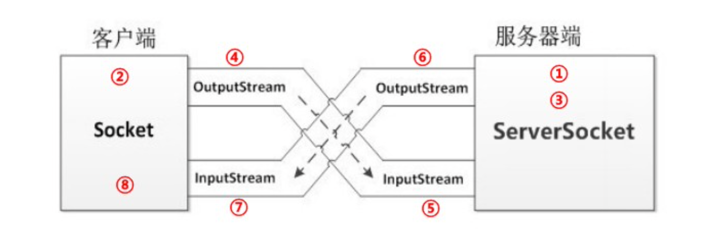

# Java 进阶 - 网络编程

- 软件架构 CS / BS
- 网络通信三要素
- TCP 通信
- Socket 套接字
- ServerSocket


## 网络编程入门

#### 软件结构

- **C/S结构** ：全称为 Client / Server 结构，是指客户端和服务器结构。
- **B/S结构** ：全称为 Browser / Server 结构，是指浏览器和服务器结构。

#### 网络通信协议

- **网络通信协议：**通过计算机网络可以使多台计算机实现连接，位于同一个网络中的计算机在进行连接和通信时需要遵守一定的规则。在计算机网络中，这些连接和通信的规则被称为网络通信协议，它对数据的传输格式、传输速率、传输步骤等做了统一规定，通信双方必须同时遵守才能完成数据交换。
- **TCP/IP协议：** 传输控制协议/因特网互联协议( Transmission Control Protocol/Internet Protocol)，是Internet最基本、最广泛的协议。它定义了计算机如何连入因特网，以及数据如何在它们之间传输的标准。它的内部包含一系列的用于处理数据通信的协议，并采用了4层的分层模型，每一层都呼叫它的下一层所提供的协议来完成自己的需求。

TCP/IP 协议中的四层分别是应用层、传输层、网络层和链路层，每层分别负责不同的通信功能。
链路层：链路层是用于定义物理传输通道，通常是对某些网络连接设备的驱动协议，例如针对光纤、网线提供的驱动。
网络层：网络层是整个TCP/IP协议的核心，它主要用于将传输的数据进行分组，将分组数据发送到目标计算机或者网络。
运输层：主要使网络程序进行通信，在进行网络通信时，可以采用TCP协议，也可以采用UDP协议。
应用层：主要负责应用程序的协议，例如HTTP协议、FTP协议等。

#### 协议分类

`java.net` 包中包含的类和接口，它们提供低层次的通信细节。

`java.net` 包中提供了两种常见的网络协议的支持：

- **UDP**：用户数据报协议(User Datagram Protocol)。UDP是无连接通信协议，即在数据传输时，数据的发送端和接收端不建立逻辑连接。简单来说，当一台计算机向另外一台计算机发送数据时，发送端不会确认接收端是否存在，就会发出数据，同样接收端在收到数据时，也不会向发送端反馈是否收到数据。

  由于使用UDP协议消耗资源小，通信效率高，所以通常都会用于音频、视频和普通数据的传输例如视频会议都使用UDP协议，因为这种情况即使偶尔丢失一两个数据包，也不会对接收结果产生太大影响。

  但是在使用UDP协议传送数据时，由于UDP的面向无连接性，不能保证数据的完整性，因此在传输重要数据时不建议使用UDP协议。UDP的交换过程如下图所示。
  
  特点：数据被限制在64kb以内，超出这个范围就不能发送了。
  
  数据报(Datagram)：网络传输的基本单位 

- **TCP**：传输控制协议 (Transmission Control Protocol)。TCP协议是**面向连接**的通信协议，即传输数据之前，在发送端和接收端建立逻辑连接，然后再传输数据，它提供了两台计算机之间可靠无差错的数据传输。

  在TCP连接中必须要明确客户端与服务器端，由客户端向服务端发出连接请求，每次连接的创建都需要经过“三次握手”。

  - 三次握手：TCP协议中，在发送数据的准备阶段，客户端与服务器之间的三次交互，以保证连接的可靠。
    - 第一次握手，客户端向服务器端发出连接请求，等待服务器确认。
    - 第二次握手，服务器端向客户端回送一个响应，通知客户端收到了连接请求。
    - 第三次握手，客户端再次向服务器端发送确认信息，确认连接。整个交互过程如下图所示。
  
  完成三次握手，连接建立后，客户端和服务器就可以开始进行数据传输了。由于这种面向连接的特性，TCP协议可以保证传输数据的安全，所以应用十分广泛，例如下载文件、浏览网页等。

#### 网络编程三要素

##### 协议

- **协议：**计算机网络通信必须遵守的规则。

##### IP 地址

- **IP地址：指互联网协议地址（Internet Protocol Address）**，俗称IP。IP地址用来给一个网络中的计算机设备做唯一的编号。
  - **IPv4**：是一个32位的二进制数，通常被分为4个字节，表示成 `a.b.c.d` 的形式，例如`192.168.65.100` 。其中a、b、c、d都是0~255之间的十进制整数，最多可以表示42亿个。
  - **IPv6**：为了扩大地址空间，拟通过IPv6重新定义地址空间，采用128位地址长度，每16个字节一组，分成8组十六进制数，表示成 `ABCD:EF01:2345:6789:ABCD:EF01:2345:6789`，号称可以为全世界的每一粒沙子编上一个网址，这样就解决了网络地址资源数量不够的问题。

**常用命令**

- 查看本机 IP 地址

```
ipconfig
```

- 检查网络是否连通

```
ping IP地址
ping 220.181.66.216
```

**特殊的 IP 地址**

- 本机 IP 地址：`127.0.0.1` 、`localhost`。

##### 端口号

网络的通信，本质上是两个进程（应用程序）的通信。每台计算机都有很多的进程，那么在网络通信时，如何区分这些进程呢？

如果说**IP地址**可以唯一标识网络中的设备，那么**端口号**就可以唯一标识设备中的进程（应用程序）了。

* **端口号：用两个字节表示的整数，它的取值范围是0~65535**。其中，0~1023之间的端口号用于一些知名的网络服务和应用，普通的应用程序需要使用1024以上的端口号。如果端口号被另外一个服务或应用所占用，会导致当前程序启动失败。

利用 `协议`+`IP地址`+`端口号` 三元组合，就可以标识网络中的进程了，那么进程间的通信就可以利用这个标识与其它进程进行交互。


## TCP 通信程序

#### 概述

TCP 通信能实现两台计算机之间的数据交互，通信的两端，要严格区分为客户端（Client）与服务端（Server）。

**两端通信时步骤：**

1. 服务端程序，需要事先启动，等待客户端的连接。
2. 客户端主动连接服务器端，连接成功才能通信。服务端不可以主动连接客户端。

**在Java中，提供了两个类用于实现TCP通信程序：**

1. 客户端：`java.net.Socket` 类表示。创建 `Socket` 对象，向服务端发出连接请求，服务端响应请求，两者建立连接开始通信。
2. 服务端：`java.net.ServerSocket` 类表示。创建 `ServerSocket` 对象，相当于开启一个服务，并等待客户端的连接。

#### Socket 类

`Socket` 类：该类实现客户端套接字，套接字指的是两台设备之间通讯的端点。

##### 构造方法

- `public Socket(String host, int port)` ：创建套接字对象并将其连接到指定主机上的指定端口号。如果指定的host是null ，则相当于指定地址为回送地址。

> 回送地址(127.x.x.x) 是本机回送地址（Loopback Address），主要用于网络软件测试以及本地机进程间通信，无论什么程序，一旦使用回送地址发送数据，立即返回，不进行任何网络传输。

```java
Socket client = new Socket("127.0.0.1", 6666);
```

##### 成员方法

- `public InputStream getInputStream()` ： 返回此套接字的输入流。
  - 如果此Scoket具有相关联的通道，则生成的InputStream 的所有操作也关联该通道。
  - 关闭生成的InputStream也将关闭相关的Socket。
- `public OutputStream getOutputStream()` ： 返回此套接字的输出流。
  - 如果此Scoket具有相关联的通道，则生成的OutputStream 的所有操作也关联该通道。
  - 关闭生成的OutputStream也将关闭相关的Socket。
- `public void close()` ：关闭此套接字。
  - 一旦一个socket被关闭，它不可再使用。
  - 关闭此socket也将关闭相关的InputStream和OutputStream 。 
- `public void shutdownOutput()` ： 禁用此套接字的输出流。   
  - 任何先前写出的数据将被发送，随后终止输出流。 

#### ServerSocket 类

`ServerSocket` 类：这个类实现了服务器套接字，该对象等待通过网络的请求。

##### 构造方法

* `public ServerSocket(int port)` ：使用该构造方法在创建ServerSocket对象时，就可以将其绑定到一个指定的端口号上，参数port就是端口号。

构造举例，代码如下：

```java
ServerSocket server = new ServerSocket(6666);
```

##### 成员方法

* `public Socket accept()` ：侦听并接受连接，返回一个新的Socket对象，用于和客户端实现通信。该方法会一直阻塞直到建立连接。 

#### 简单的 TCP 网络程序

##### TCP 通信分析图解

1. 【服务端】启动,创建ServerSocket对象，等待连接。
2. 【客户端】启动,创建Socket对象，请求连接。
3. 【服务端】接收连接,调用accept方法，并返回一个Socket对象。
4. 【客户端】Socket对象，获取OutputStream，向服务端写出数据。
5. 【服务端】Scoket对象，获取InputStream，读取客户端发送的数据。

> 到此，客户端向服务端发送数据成功。



> 自此，服务端向客户端回写数据。

6. 【服务端】Socket对象，获取OutputStream，向客户端回写数据。
7. 【客户端】Scoket对象，获取InputStream，解析回写数据。
8. 【客户端】释放资源，断开连接。

##### 客户端向服务端发送数据

**服务端实现**

```java
public class ServerTCP {
	public static void main(String[] args) throws IOException {
		System.out.println("服务端启动，等待连接...");
		// 1.创建 ServerSocket对象，绑定端口，开始等待连接
		ServerSocket ss = new ServerSocket(6666);
		// 2.接收连接 accept 方法, 返回 socket 对象.
		Socket server = ss.accept();
		// 3.通过socket 获取输入流
		InputStream is = server.getInputStream();
		byte[] b = new byte[1024];
		int len = is.read(b);
		String msg = new String(b, 0, len);
		System.out.println(msg);
		is.close();
		server.close();
	}
}
```

**客户端实现**

```java
public class ClientTCP {
	public static void main(String[] args) throws Exception {
		System.out.println("客户端 发送数据");
		Socket client = new Socket("localhost", 6666);
		OutputStream os = client.getOutputStream();
		os.write("你好，tcp".getBytes());
		os.close();
		client.close();
	}
}
```

##### 服务器向客户端回写数据

**服务端实现：**

```java
public class ServerTCP {
    public static void main(String[] args) throws IOException {
        System.out.println("服务端启动 , 等待连接 .... ");
        // 1.创建 ServerSocket对象，绑定端口，开始等待连接
        ServerSocket ss = new ServerSocket(6666);
        // 2.接收连接 accept 方法, 返回 socket 对象.
        Socket server = ss.accept();
        // 3.通过socket 获取输入流
        InputStream is = server.getInputStream();
        // 4.一次性读取数据
      	// 4.1 创建字节数组
        byte[] b = new byte[1024];
      	// 4.2 据读取到字节数组中.
        int len = is.read(b)；
        // 4.3 解析数组,打印字符串信息
        String msg = new String(b, 0, len);
        System.out.println(msg);
      	// =================回写数据=======================
      	// 5. 通过 socket 获取输出流
      	 OutputStream out = server.getOutputStream();
      	// 6. 回写数据
      	 out.write("我很好,谢谢你".getBytes());
      	// 7.关闭资源.
      	out.close();
        is.close();
        server.close();
    }
}
```

**客户端实现：**

```java
public class ClientTCP {
	public static void main(String[] args) throws Exception {
		System.out.println("客户端 发送数据");
		// 1.创建 Socket ( ip , port ) , 确定连接到哪里.
		Socket client = new Socket("localhost", 6666);
		// 2.通过Scoket,获取输出流对象 
		OutputStream os = client.getOutputStream();
		// 3.写出数据.
		os.write("你好么? tcp ,我来了".getBytes());
      	// ==============解析回写=========================
      	// 4. 通过Scoket,获取 输入流对象
      	InputStream in = client.getInputStream();
      	// 5. 读取数据数据
      	byte[] b = new byte[100];
      	int len = in.read(b);
      	System.out.println(new String(b, 0, len));
		// 6. 关闭资源 .
      	in.close();
		os.close();
		client.close();
	}
}
```

## 综合案例

#### 文件上传案例

**保存文件**

```java
public class FileUpload_Server {
    public static void main(String[] args) throws IOException {
        System.out.println("服务器 启动.....  ");
        // 1. 创建服务端ServerSocket
        ServerSocket serverSocket = new ServerSocket(6666);
      	// 2. 循环接收,建立连接
        while (true) {
            Socket accept = serverSocket.accept();
          	/* 
          	3. socket对象交给子线程处理,进行读写操作
               Runnable接口中,只有一个run方法,使用lambda表达式简化格式
            */
            new Thread(() -> {
                try (
                    //3.1 获取输入流对象
                    BufferedInputStream bis = new BufferedInputStream(accept.getInputStream());
                    //3.2 创建输出流对象, 保存到本地 .
                    FileOutputStream fis = new FileOutputStream(System.currentTimeMillis() + ".jpg");
                    BufferedOutputStream bos = new BufferedOutputStream(fis);) {
                    // 3.3 读写数据
                    byte[] b = new byte[1024 * 8];
                    int len;
                    while ((len = bis.read(b)) != -1) {
                      bos.write(b, 0, len);
                    }
                    //4. 关闭 资源
                    bos.close();
                    bis.close();
                    accept.close();
                    System.out.println("文件上传已保存");
                } catch (IOException e) {
                  	e.printStackTrace();
                }
            }).start();
        }
    }
}

**回写文件**

​```java
public class FileUpload_Server {
    public static void main(String[] args) throws IOException {
        System.out.println("服务器 启动.....  ");
        // 1. 创建服务端ServerSocket
        ServerSocket serverSocket = new ServerSocket(6666);
        // 2. 循环接收,建立连接
        while (true) {
            Socket accept = serverSocket.accept();
          	/*
          	3. socket对象交给子线程处理,进行读写操作
               Runnable接口中,只有一个run方法,使用lambda表达式简化格式
            */
            new Thread(() -> {
                try (
                    //3.1 获取输入流对象
                    BufferedInputStream bis = new BufferedInputStream(accept.getInputStream());
                    //3.2 创建输出流对象, 保存到本地 .
                    FileOutputStream fis = new FileOutputStream(System.currentTimeMillis() + ".jpg");
                    BufferedOutputStream bos = new BufferedOutputStream(fis);
                ) {
                    // 3.3 读写数据
                    byte[] b = new byte[1024 * 8];
                    int len;
                    while ((len = bis.read(b)) != -1) {
                        bos.write(b, 0, len);
                    }

                    // 4.=======信息回写===========================
                    System.out.println("back ........");
                    OutputStream out = accept.getOutputStream();
                    out.write("上传成功".getBytes());
                    out.close();
                    //================================

                    //5. 关闭 资源
                    bos.close();
                    bis.close();
                    accept.close();
                    System.out.println("文件上传已保存");
                } catch (IOException e) {
                    e.printStackTrace();
                }
            }).start();
        }
    }
}
```

